PAV - P5: síntesis musical polifónica
=====================================

Obtenga su copia del repositorio de la práctica accediendo a [Práctica 5](https://github.com/albino-pav/P5) 
y pulsando sobre el botón `Fork` situado en la esquina superior derecha. A continuación, siga las
instrucciones de la [Práctica 2](https://github.com/albino-pav/P2) para crear una rama con el apellido de
los integrantes del grupo de prácticas, dar de alta al resto de integrantes como colaboradores del proyecto
y crear la copias locales del repositorio.

Como entrega deberá realizar un *pull request* con el contenido de su copia del repositorio. Recuerde que
los ficheros entregados deberán estar en condiciones de ser ejecutados con sólo ejecutar:

~~~~~~~~~~~~~~~~~~~~~~~~~~~~~~~~~~~~~~~~~~~~~~~~~~~~~.sh
  make release
~~~~~~~~~~~~~~~~~~~~~~~~~~~~~~~~~~~~~~~~~~~~~~~~~~~~~

A modo de memoria de la práctica, complete, en este mismo documento y usando el formato *markdown*, los
ejercicios indicados.

Ejercicios.
-----------

### Envolvente ADSR.

Tomando como modelo un instrumento sencillo (puede usar el InstrumentDumb), genere cuatro instrumentos que
permitan visualizar el funcionamiento de la curva ADSR.

* Un instrumento con una envolvente ADSR genérica, para el que se aprecie con claridad cada uno de sus
  parámetros: ataque (A), caída (D), mantenimiento (S) y liberación (R).

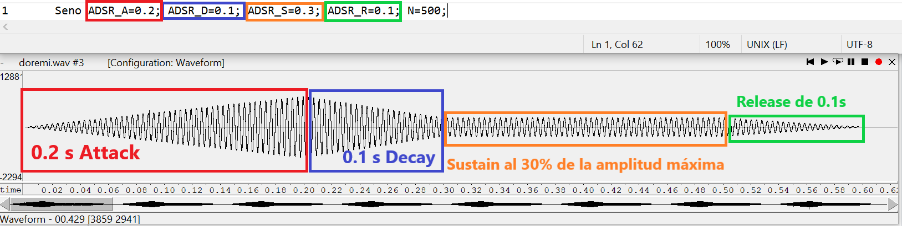

* Un instrumento *percusivo*, como una guitarra o un piano, en el que el sonido tenga un ataque rápido, no
  haya mantenimiemto y el sonido se apague lentamente.
  - Para un instrumento de este tipo, tenemos dos situaciones posibles:
    * El intérprete mantiene la nota *pulsada* hasta su completa extinción.
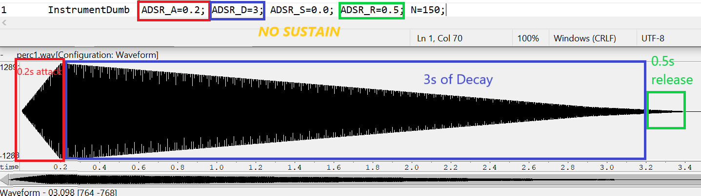
    * El intérprete da por finalizada la nota antes de su completa extinción, iniciándose una disminución
	  abrupta del sonido hasta su finalización.
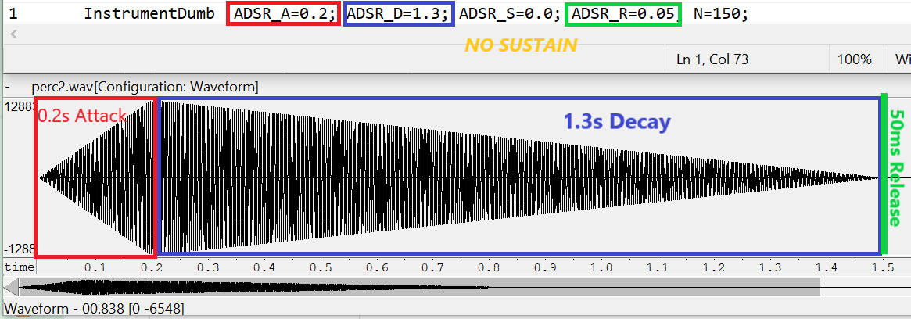
  - Debera representar en esta memoria **ambos** posibles finales de la nota.
* Un instrumento *plano*, como los de cuerdas frotadas (violines y semejantes) o algunos de viento. En
  ellos, el ataque es relativamente rápido hasta alcanzar el nivel de mantenimiento (sin sobrecarga), y la
  liberación también es bastante rápida.
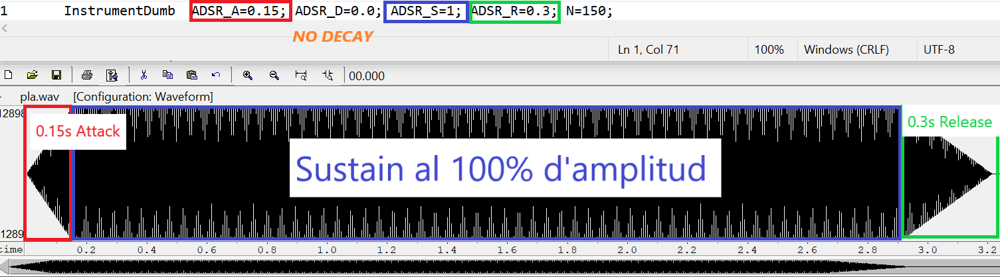
Para los cuatro casos, deberá incluir una gráfica en la que se visualice claramente la curva ADSR. Deberá
añadir la información necesaria para su correcta interpretación, aunque esa información puede reducirse a
colocar etiquetas y títulos adecuados en la propia gráfica (se valorará positivamente esta alternativa).

### Instrumentos Dumb y Seno.

Implemente el instrumento `Seno` tomando como modelo el `InstrumentDumb`. La señal **deberá** formarse
mediante búsqueda de los valores en una tabla.

- Incluya, a continuación, el código del fichero `seno.cpp` con los métodos de la clase Seno.
```cpp
#include <iostream>
#include <math.h>
#include "seno.h"
#include "keyvalue.h"

#include <stdlib.h>

using namespace upc;
using namespace std;

Seno::Seno(const std::string &param)
    : adsr(SamplingRate, param)
{
  bActive = false; //Declaramos el instrumento INACTIVO
  x.resize(BSIZE); //Ubicamos el espacio para almacenar un Tick de señal

  /*
    You can use the class keyvalue to parse "param" and configure your instrument.
    Take a Look at keyvalue.h    
  */
  KeyValue kv(param);
  int N; //Parámetro de interes --> Longitud de la tabla N

  if (!kv.to_int("N", N))
    N = 40; //default value

  //Create a tbl with one period of a sinusoidal wave
  tbl.resize(N);
  float phase = 0, step = 2 * M_PI / (float)N;
  index = 0.0;
  indexStep = 0.0;
  for (int i = 0; i < N; ++i)
  {
    tbl[i] = sin(phase);
    phase += step;
  }
}

//Para cada linea del fichero MIDI, tomamos --> Comando / Nota / Actividad
void Seno::command(long cmd, long note, long vel)
{
  if (cmd == 9)
  {                 //'Key' pressed: attack begins
    bActive = true; //Declaramos activo el instrumento
    adsr.start();   //Iniciamos curva ADSR
    index = 0;      //Contador para recorrer la tabla
    A = vel / 127.;
    float exp = ((float)note - 69.0) / 12.0;
    f0 = 440.0 * pow(2.0, exp);
    indexStep = (tbl.size() * f0) / SamplingRate;
    //cout << indexStep << '\n';
  }
  else if (cmd == 8)
  { //'Key' released: sustain ends, release begins
    adsr.stop();
  }
  else if (cmd == 0)
  { //Sound extinguished without waiting for release to end
    adsr.end();
  }
}

const vector<float> &Seno::synthesize()
{
  //Si la nota ya ha llegado a su FINAL
  if (not adsr.active())
  {
    x.assign(x.size(), 0); //Asignamos a la señal sintetizada (vector x) el valor 0
    bActive = false;       //Marcamos la nota como inactiva
    return x;
  }
  else if (not bActive)
    return x;
  //Nota ACTIVA --> Realizamos sinstesis y aplicamos envolvente ADSR  
  for (unsigned int i = 0; i < x.size(); ++i)
  {


    if ((unsigned int) ceil(index) == tbl.size())
    { //Caso especial donde tenemos que interpolar entre el primer y último valor de la tabla
      x[i] = A * (((1.0 - (index - floor(index))) * tbl[floor(index)]) + ((1.0 - (ceil(index) - index)) * tbl[0]));
    }
    else
    {//Aplicamos interpolación
      x[i] = A * (((1.0 - (index - floor(index))) * tbl[floor(index)]) + ((1.0 - (ceil(index) - index)) * tbl[ceil(index)]));
    }
    
    index = fmod(index + indexStep, tbl.size());
 
  }
  adsr(x); //apply envelope to x and update internal status of ADSR

  return x;
}

```
- Explique qué método se ha seguido para asignar un valor a la señal a partir de los contenidos en la tabla,
  e incluya una gráfica en la que se vean claramente (use pelotitas en lugar de líneas) los valores de la
  tabla y los de la señal generada.

Primerament tenim en compte que la taula consisteix en un total de N valors del període d’una sinusoide, de forma que si tenim, 
per exemple una taula de longitud N = 8, la podem representar com:

						Table [ i ] = sin⁡(2π·i/N) 

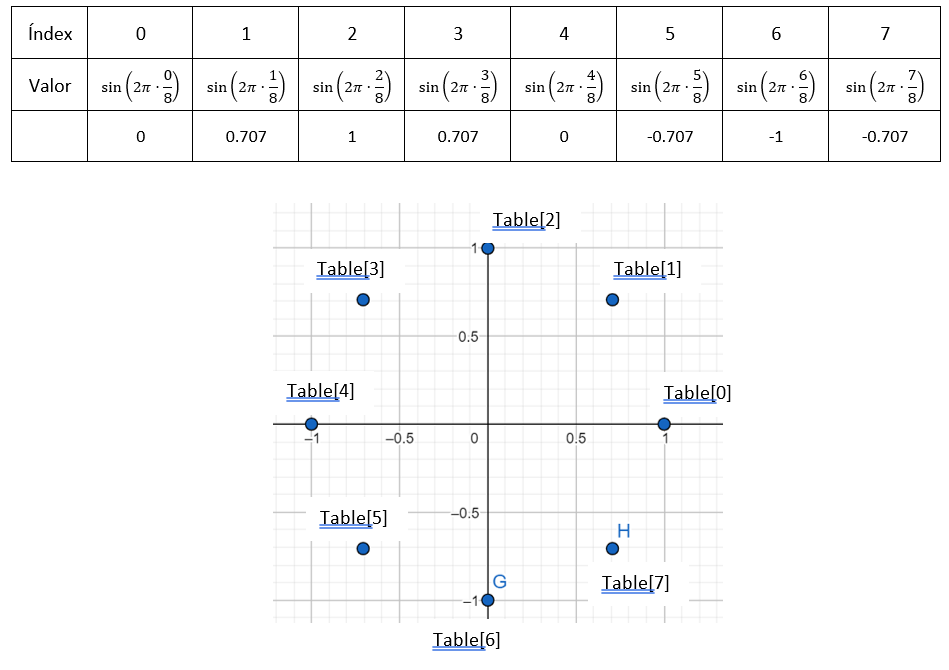
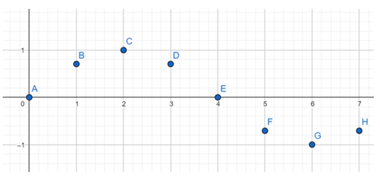

D’aquesta manera, tindrem més precisió en la representació del sinus com més gran sigui la longitud de la taula, N, i podrem generar amb més precisió els tons de diferents freqüències.
A l’hora de representar la senyal amb la nota o el to requerit, seguim el següent procediment:

1.Sabem que la nota (Note) ve expressada en semitons, i es correspon amb:
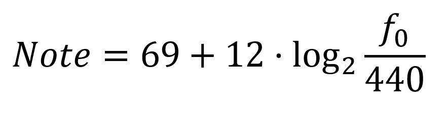

2.Sabem que, la freqüència de la sinusoide emmagatzemada a la nostra taula ve determinada per:
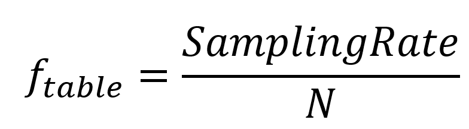

(En cas que recorrem els valors de la taula de un en un)

3.Si reproduïm els valors de la taula de k en k, aleshores:

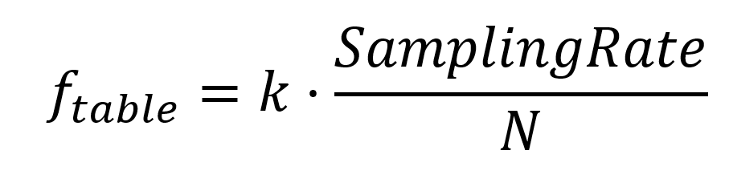

4.Per tant, jugant amb el valor de k podem obtenir sinusoides de la freqüència que vulguem, de manera que si volem reproduir una 
sinusoide de freqüència f0, corresponent a una determinada Note, calculem k:

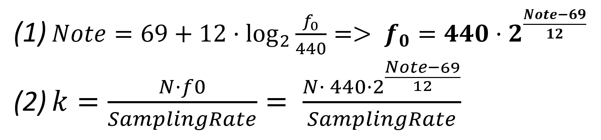


5.Això ens genera el següent problema: Com que obtindrem valors de k amb decimals, al actualitzar els valors dels índex de la taula 
als quals volem accedir, aquests també seran decimals, i no podrem accedir a aquestes posicions perquè no estan definides. Per tal 
de resoldre aquest problema, realitzem una interpolació lineal entre els valors corresponents als índex superior e inferior als quals 
està definit el nostre índex actual, de la manera següent:

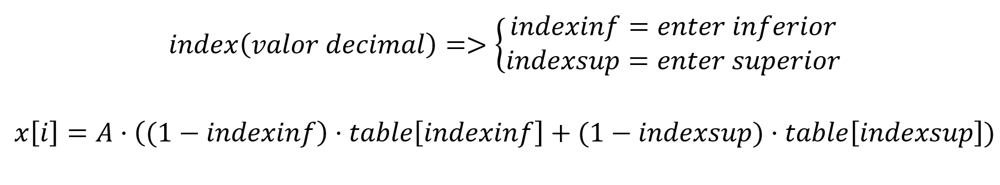


- Si ha implementado la síntesis por tabla almacenada en fichero externo, incluya a continuación el código
  del método `command()`.

### Efectos sonoros.

- Incluya dos gráficas en las que se vean, claramente, el efecto del trémolo y el vibrato sobre una señal
  sinusoidal. Deberá explicar detalladamente cómo se manifiestan los parámetros del efecto (frecuencia e
  índice de modulación) en la señal generada (se valorará que la explicación esté contenida en las propias
  gráficas, sin necesidad de *literatura*).

Senyal sinusoidal de freqüència 82 Hz:


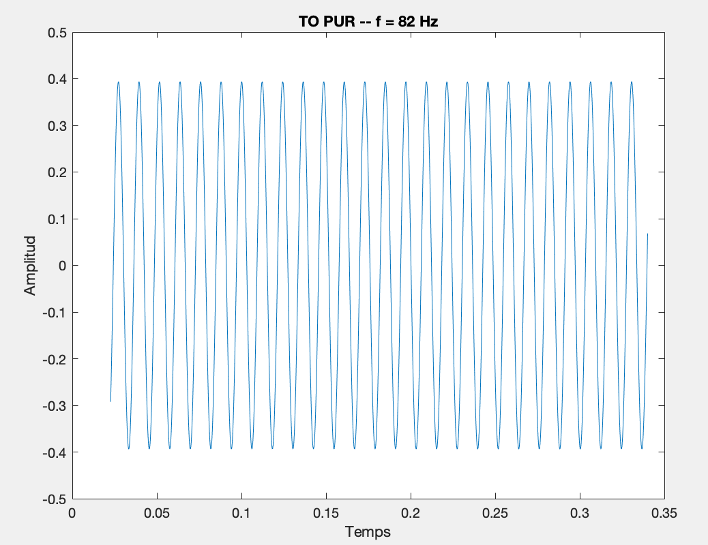

  Tremolo sobre senyal sinusoidal:

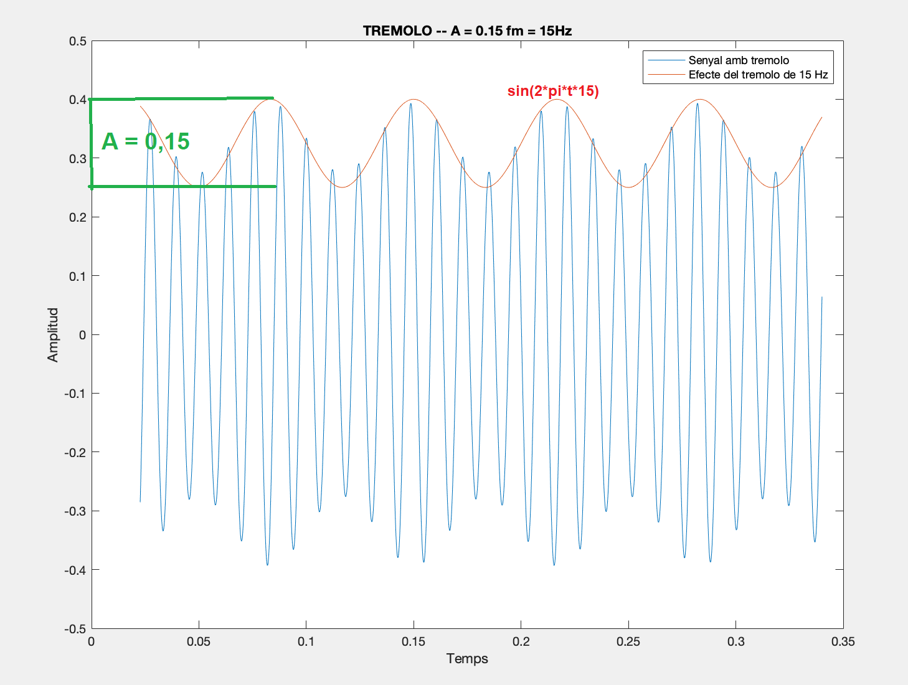

  Vibrato sobre senyal sinusoidal:

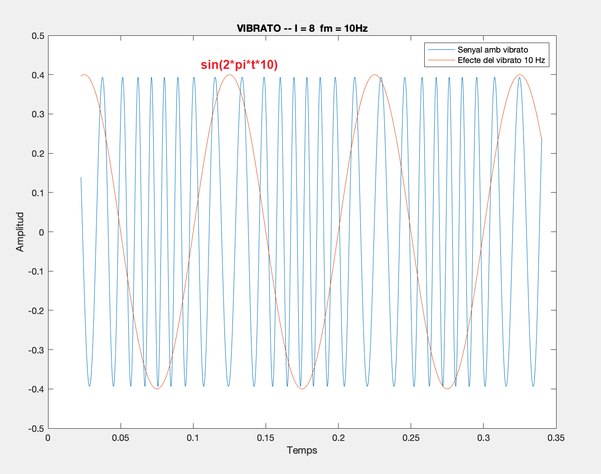

  De tota manera, com que l'efecte del vibrato és una modulació de la freqüència, s'aprecia més bé en el domini 
  freqüencial que en domini temporal. En la figura següent veiem clarament l'efecte del vibrato, concretament, 
  podem veure que el nostre paràmetre I equival a la e i la freqüència de modulació és equivalent a la seva f.

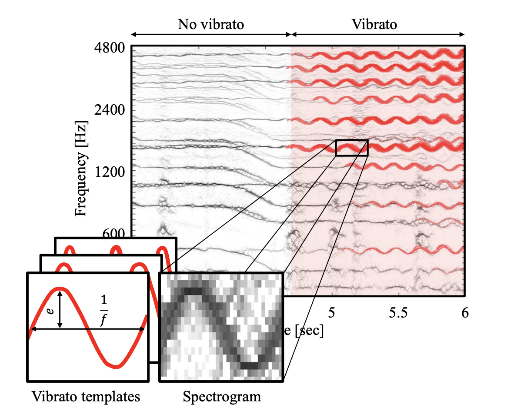

  En el nostre cas, no hem estat capaços d'obtenir un resultat tant clar. De tota manera, hem estat capaços
  d'apreciar l'efecte del vibrato;

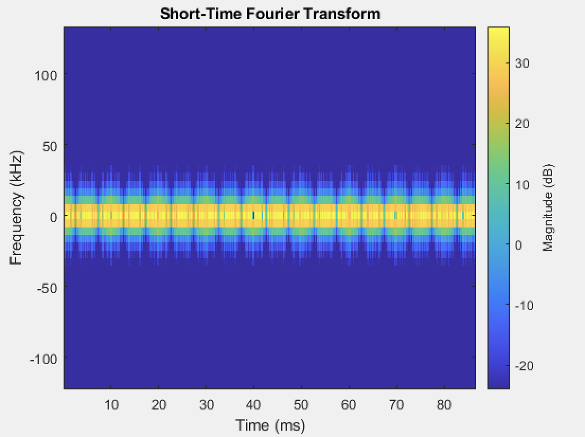

- Si ha generado algún efecto por su cuenta, explique en qué consiste, cómo lo ha implementado y qué
  resultado ha producido. Incluya, en el directorio `work/ejemplos`, los ficheros necesarios para apreciar
  el efecto, e indique, a continuación, la orden necesaria para generar los ficheros de audio usando el
  programa `synth`.

### Síntesis FM.

Construya un instrumento de síntesis FM, según las explicaciones contenidas en el enunciado y el artículo
de [John M. Chowning](https://ccrma.stanford.edu/sites/default/files/user/jc/fm_synthesispaper-2.pdf). El
instrumento usará como parámetros **básicos** los números `N1` y `N2`, y el índice de modulación `I`, que
deberá venir expresado en semitonos.

- Use el instrumento para generar un vibrato de *parámetros razonables* e incluya una gráfica en la que se
  vea, claramente, la correspondencia entre los valores `N1`, `N2` e `I` con la señal obtenida.

Els paràmetres N1 i N2 marquen la relació entre la freqüència portadora (carrier) i la freqüencia de modulació, 
  per tant, per realitzar l'efecte del vibrato hem creat un to de 260 Hz i hem seleccionat N1 = 52 i N2 = 3, de 
  manera que el valor de la freqüència portadora és de 15Hz. Amb aquests valors l'efecte del vibrato és notòri.

  El paràmetre I és l'index de modulació de la freqüència i correspon al nivell màxim i mínim de variació de la 
  freqüència. S'expressa en semitons. En les següents imatges podem veure clarament l'efecte de l'index de modulació,
  de manera que a mesura que augmentem el paràmetre més important és la modulació de la freqüència.

  I = 5 / N1 = 52 / N2 = 3

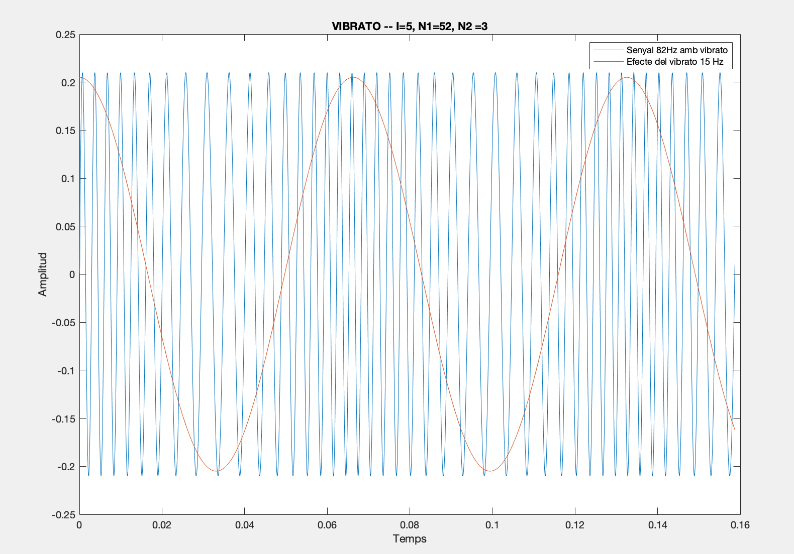

  I = 10 / N1 = 52 / N2 = 3

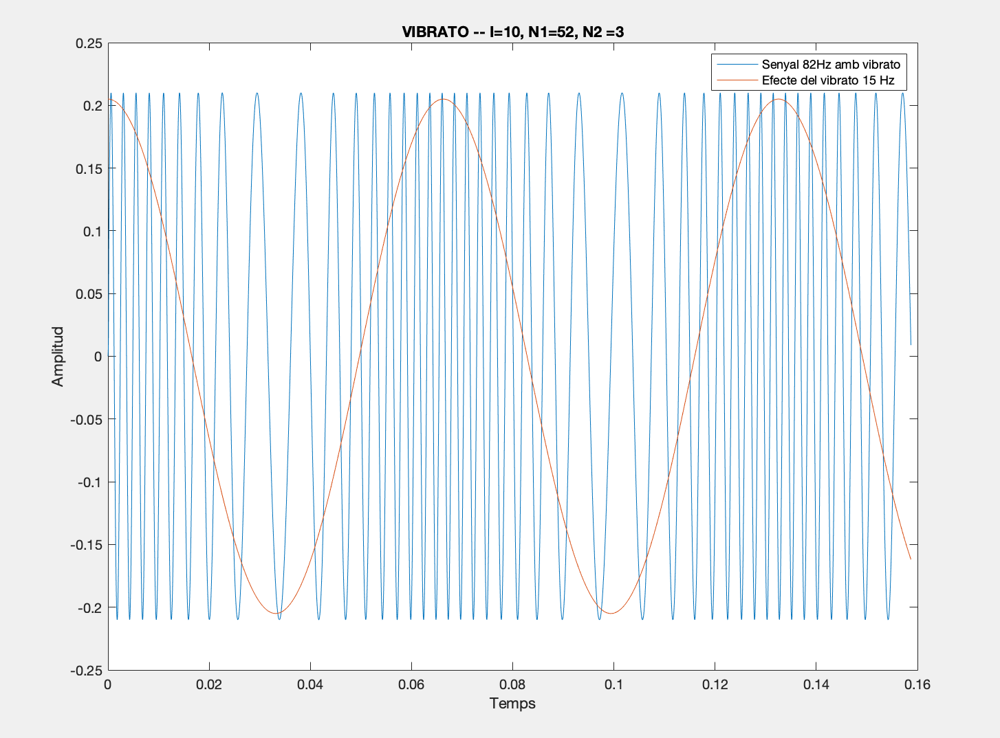

  I = 5 / N1 = 52 / N2 = 3

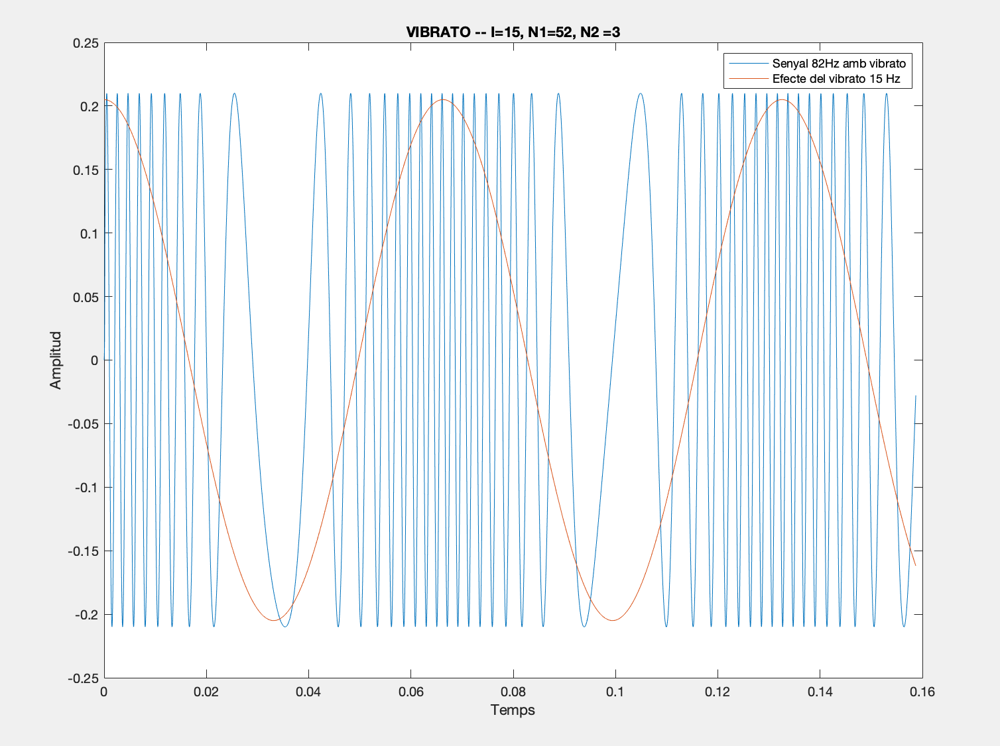


- Use el instrumento para generar un sonido tipo clarinete y otro tipo campana. Tome los parámetros del
  sonido (N1, N2 e I) y de la envolvente ADSR del citado artículo. Con estos sonidos, genere sendas escalas
  diatónicas (fichero `doremi.sco`) y ponga el resultado en los ficheros `work/doremi/clarinete.wav` y
  `work/doremi/campana.work`.

~~~~~~~~~~~~~~~~~~~~~~~~~~~~~~~~~~~~~~~~~~~~~~~~~~~~~.sh
  - CLARINET:

    7 InstrumentFM2 ADSR_A=0.1; ADSR_D=0.00; ADSR_S=0.5; ADSR_R=0.05; I=2; N1 = 3; N2= 2;

    Arxius: clarinet.wav

  - CAMPANA:

    8 InstrumentFM2 ADSR_A=0.01; ADSR_D=0.7; ADSR_S=0.0; ADSR_R=0.5; I=4; N1 = 5; N2= 7;

    Arxius: campana.wav, campana2.wav, campana_escala.wav.
~~~~~~~~~~~~~~~~~~~~~~~~~~~~~~~~~~~~~~~~~~~~~~~~~~~~~

  * También puede colgar en el directorio work/doremi otras escalas usando sonidos *interesantes*. Por
    ejemplo, violines, pianos, percusiones, espadas láser de la
	[Guerra de las Galaxias](https://www.starwars.com/), etc.

~~~~~~~~~~~~~~~~~~~~~~~~~~~~~~~~~~~~~~~~~~~~~~~~~~~~~.sh
 - PIANOLA

    2   InstrumentFM2   ADSR_A=0.001; ADSR_D=0.1; ADSR_S=0.8; ADSR_R=0.25; I=1.25; N1 = 1; N2= 3;

    Arxius: escala_piano.wav, piano.wav
~~~~~~~~~~~~~~~~~~~~~~~~~~~~~~~~~~~~~~~~~~~~~~~~~~~~~

### Orquestación usando el programa synth.

Use el programa `synth` para generar canciones a partir de su partitura MIDI. Como mínimo, deberá incluir la
*orquestación* de la canción *You've got a friend in me* (fichero `ToyStory_A_Friend_in_me.sco`) del genial
[Randy Newman](https://open.spotify.com/artist/3HQyFCFFfJO3KKBlUfZsyW/about).

- En este triste arreglo, la pista 1 corresponde al instrumento solista (puede ser un piano, flautas,
  violines, etc.), y la 2 al bajo (bajo eléctrico, contrabajo, tuba, etc.).

~~~~~~~~~~~~~~~~~~~~~~~~~~~~~~~~~~~~~~~~~~~~~~~~~~~~~~~~~~~~~~~~~~~~~~~~~~~~~~~~~~~~~~~~~~~~~~~~~~~~~~~.sh
  - PIANO:
    1   InstrumentFM2   ADSR_A=0.001; ADSR_D=0.1; ADSR_S=0.8; ADSR_R=0.25; I=1.25; N1 = 1; N2= 3;

  - BAIX:
    2   InstrumentFM2   ADSR_A=0.01; ADSR_D=0.0; ADSR_S=0.0; ADSR_R=0.4; I=1; N1 = 1.0; N2= 3;
~~~~~~~~~~~~~~~~~~~~~~~~~~~~~~~~~~~~~~~~~~~~~~~~~~~~~~~~~~~~~~~~~~~~~~~~~~~~~~~~~~~~~~~~~~~~~~~~~~~~~~~

- Coloque el resultado, junto con los ficheros necesarios para generarlo, en el directorio `work/music`.

~~~~~~~~~~~~~~~~~~~~~~~~~~~~~~~~~~~~~~~~~~~~~~~~~~~~~.sh
 Arxiu: toy.wav
~~~~~~~~~~~~~~~~~~~~~~~~~~~~~~~~~~~~~~~~~~~~~~~~~~~~~

- Indique, a continuación, la orden necesaria para generar la señal (suponiendo que todos los archivos
  necesarios están en directorio indicado).


~~~~~~~~~~~~~~~~~~~~~~~~~~~~~~~~~~~~~~~~~~~~~~~~~~~~~.sh
  Toy Story:
 	synth toy_orc.orc ToyStory_A_Friend_in_me.sco toy.wav
~~~~~~~~~~~~~~~~~~~~~~~~~~~~~~~~~~~~~~~~~~~~~~~~~~~~~

También puede orquestar otros temas más complejos, como la banda sonora de *Hawaii5-0* o el villacinco de
John Lennon *Happy Xmas (War Is Over)* (fichero `The_Christmas_Song_Lennon.sco`), o cualquier otra canción
de su agrado o composición. Se valorará la riqueza instrumental, su modelado y el resultado final.
- Coloque los ficheros generados, junto a sus ficheros `score`, `instruments` y `efffects`, en el directorio
  `work/music`.
- Indique, a continuación, la orden necesaria para generar cada una de las señales usando los distintos
  ficheros.

~~~~~~~~~~~~~~~~~~~~~~~~~~~~~~~~~~~~~~~~~~~~~~~~~~~~~.sh
  REMIX Hawaii5-0:
	synth orquestra.orc Hawaii5-0.sco hawai.wav
~~~~~~~~~~~~~~~~~~~~~~~~~~~~~~~~~~~~~~~~~~~~~~~~~~~~~
